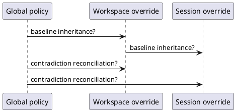

# Task: Multi-scope configuration chain and policy reconciliation
- **Task Identifier:** 2026-04-22-multi-scope-chain
- **Scope:**
  Define and implement deferred session/workspace/global scope model,
  including chain semantics, scope selection UX, and contradiction
  reconciliation rules.
- **Motivation:**
  Preserve a safe global baseline while supporting local overrides with
  deterministic behavior.
- **Scenario:**
  User configures policy globally, then uses workspace/session overrides
  without accidentally bypassing critical global intent, and scope
  selection remains deterministic when a change could fit multiple
  levels.
- **Constraints:**
  - Must be compatible with Fence `extends` semantics.
  - Must define contradiction behavior explicitly per field family.
  - Must define whether reconciliation is advisory or transactional.
- **Briefing:**
  This task is intentionally deferred. Current implementation task is
  global-only and does not include scope-selection LLM flow.
- **Research:**
  Known design branches to resolve:
  - Scope precedence model:
    - winner-takes-all vs enforced chain.
  - Baseline ownership for global is already decided in current task:
    - `<agentDir>/fence/global.json` extends `@base`,
    - `~/.config/fence/fence.json` bootstraps with `{"extends":"code"}`
      when missing.
    Multi-scope rules must build on this baseline.
  - Contradiction handling:
    - whether global updates prune lower-scope contradictions.
  - Apply transaction scope:
    - single-file vs multi-file atomic transaction.
  - Prompt/tool strategy:
    - whether scope decision remains LLM-driven.

- **Design:**
  To be done.
- **Test specification:**
  - **Automated tests:** To be done.
  - **Manual tests:** To be done.
