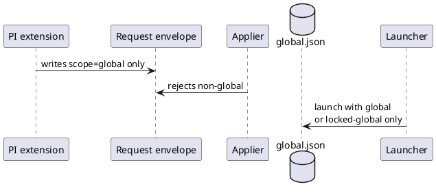
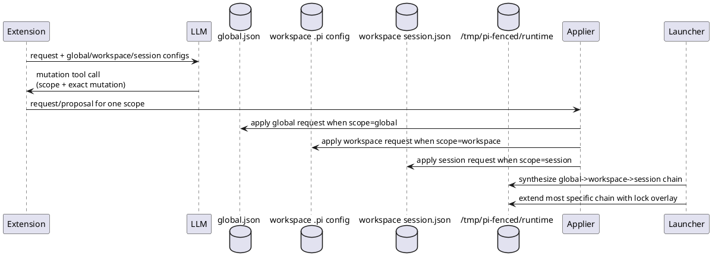

# Task: Multi-scope configuration chain and policy reconciliation
- **Task Identifier:** 2026-04-22-multi-scope-chain
- **Scope:**
  Replace the deferred multi-scope placeholder with a concrete
  session/workspace/global design for `/configure-fence`, external
  apply, and launcher-time config composition.
- **Motivation:**
  Users need persistent global defaults, repository-local overrides,
  and temporary session changes without losing deterministic behavior
  or forcing a separate scope-selection flow.
- **Scenario:**
  User runs PI in a repository that already has workspace `.pi`
  Fence configs, continues work with `-c` or `--continue` so a
  temporary session overlay is still active, switches conversations via
  `/resume` without changing session-scope ownership, and asks
  `/configure-fence` to tighten a rule. The LLM receives the current
  global, workspace, and session configs, chooses one scope to edit,
  defaults to global for new shared policy, but keeps editing
  workspace or session when that policy is already owned there. On the
  next fresh PI start that does not use `-c` or `--continue`, launcher
  clears session scope before composing global, workspace, and session
  so temporary rules do not leak.
- **Constraints:**
  - `/configure-fence` mutation tool must expose `scope` with enum
    values `global`, `workspace`, and `session`.
  - The mutation prompt must provide the current global, workspace,
    and session config contents when those files exist.
  - Workspace scope must live inside the workspace `.pi` directory.
  - Scope defaults to `global`; when the relevant policy is already
    defined in workspace or session config, the LLM should keep
    editing the most specific existing owner unless the user
    explicitly asks to move it.
  - Launcher effective configuration order is global -> workspace ->
    session.
  - Updating one scope must not prune, rewrite, or reconcile other
    scope files; normal precedence resolves disagreement.
  - Global bootstrap remains `~/.config/fence/fence.json` with
    `{"extends":"code"}` and `<agentDir>/fence/global.json` with
    `{"extends":"@base"}`.
  - Workspace and session scope files are overlay bodies; launcher
    owns the runtime chain and injects their `extends` links.
  - Session scope lives at `<workspaceRoot>/.pi/fence/session.json`.
  - Session scope is a workspace-local temporary overlay, not a file
    tied to a particular PI conversation or session file.
  - Launcher preserves session scope for `-c` and `--continue`, and
    also for launcher-controlled restarts within the same continuation
    chain.
  - Launcher deletes session scope before a fresh PI start that does
    not use `-c` or `--continue`.
  - In-PI `/resume` must not retarget session scope or require restart
    by itself.
  - One `/configure-fence` request updates exactly one scope file.
  - External apply remains replace-only and must validate target
    paths for every scope.
- **Briefing:**
  Current code still implements the global-only vertical slice.
  `index.ts` hardcodes the global target, `launcher/pi-fenced.ts`
  always launches with global or locked-global settings, and
  `apply/global-path-policy.ts` rejects non-global requests. At the
  same time, `configure-fence.ts` and `apply/request-contract.ts`
  already contain partial multi-scope scaffolding that now needs to be
  completed around the new single-tool scope model.
- **Research:**
  Verified current state:
  - `index.ts` uses `resolveGlobalConfigTargetPath()`, always renders
    `Resolved scope: global (fixed in v1)`, and writes a global-only
    request envelope.
  - `configure-fence.ts` still contains unused scope-decision helpers
    and prompt builders that assume `exactly one scope file is active`
    and `no merge`; those assumptions now contradict the target
    behavior.
  - `apply/request-contract.ts` already parses `scope` as
    `session|workspace|global`, but `apply/global-path-policy.ts`
    rejects anything except `global`.
  - `launcher/path-resolution.ts` resolves only base/global/
    preferences paths; there are no workspace or session target
    helpers.
  - `launcher/active-session-state.ts` tracks the active session file
    for relaunch continuity only; that state is useful for reopening
    the same conversation after apply, but it does not match the new
    workspace-local session-scope ownership model.
  - Launcher has no lifecycle handling yet for
    `<workspaceRoot>/.pi/fence/session.json`; it neither clears the
    file on fresh non-continue starts nor preserves it as a deliberate
    continuation-scope overlay.
  - `launcher/pi-fenced.ts` always launches Fence with global or
    locked-global settings, so effective multi-scope composition does
    not exist yet.

- **Design:**
  Final decisions for this task:
  1. Remove the separate scope-decision tool call from the command
     flow. `/configure-fence` will use a single mutation tool that
     returns both mutation data and the selected scope.
  2. Deterministic precedence replaces the old reconciliation branch
     work. There is no cross-scope pruning or transactional multi-file
     rewrite in this task.
  3. Launcher combines scopes at runtime in this fixed order:
     global, then workspace, then session.

  Target scope files:
  - global: `<agentDir>/fence/global.json`
  - workspace: `<workspaceRoot>/.pi/fence/workspace.json`
  - session: `<workspaceRoot>/.pi/fence/session.json`
  - `workspaceRoot` comes from the current command working tree
    (`ctx.cwd` in the extension, launcher process cwd at startup).
  - Session scope is a workspace-local temporary overlay shared across
    conversations inside the same continuation chain.

  Structured mutation contract:
  - Extend `configure_fence_mutation_proposal` with field:
    - `scope: "global" | "workspace" | "session"`
    - schema default: `"global"`
  - Keep `requestValidity`, `mutationType`, `reasoning`,
    `changeMode`, `effectSummary`, `conflictSummary`, `writeContent`,
    `edits`, and `invalidReason`.
  - Scope is chosen in the same tool call as the mutation proposal.
  - The mutation prompt must include:
    - current global config content or `missing`,
    - current workspace config content or `missing`,
    - current session config content or `missing`,
    - precedence reminder `session > workspace > global`,
    - default rule `global unless the policy is already handled in a
      more specific scope`,
    - note that session scope is the temporary workspace-local file
      `<workspaceRoot>/.pi/fence/session.json`,
    - note that session scope survives only `-c`/`--continue` and
      launcher-controlled restarts, not a fresh non-continue start,
    - instruction that workspace and session overlays must not add
      top-level `extends` because launcher owns the chain.

  Request and target validation:
  - Keep one request file and one proposal file per change.
  - Keep request envelope `version: 1`.
  - Extend the request payload with scope context needed for path
    validation:
    - `workspaceRoot?: string` required for `scope="workspace"`
      and `scope="session"`, and must be an absolute path.
  - Replace `assertGlobalTargetPolicy()` with
    `assertScopedTargetPolicy()`:
    - `global` target must equal `<agentDir>/fence/global.json`,
    - `workspace` target must equal
      `<workspaceRoot>/.pi/fence/workspace.json`,
    - `session` target must equal
      `<workspaceRoot>/.pi/fence/session.json`.

  Launcher composition:
  - Add path helpers for workspace and session targets in
    `launcher/path-resolution.ts`.
  - Before building the chain, launcher classifies session-scope
    lifetime for the current start:
    - initial user launch preserves session scope only when PI args
      include `-c` or `--continue`,
    - launcher-controlled restarts inside the same run preserve the
      existing session scope file even when relaunch uses
      `--session <tracked-file>`,
    - otherwise launcher deletes
      `<workspaceRoot>/.pi/fence/session.json` before resolving the
      active chain.
  - Active-session tracking from the restart-loop task remains only
    for reopening the same PI conversation after apply; it does not
    determine session-scope config ownership.
  - Launcher resolves the active scope files for the current run:
    - global is always present after bootstrap,
    - workspace is included when
      `<workspaceRoot>/.pi/fence/workspace.json` exists,
    - session is included when
      `<workspaceRoot>/.pi/fence/session.json` exists after the
      cleanup/preservation rule above.
  - Launcher writes runtime chain files under `/tmp/pi-fenced/runtime`
    so Fence performs the final merge:
    - workspace runtime file = workspace overlay body with injected
      `extends: <global-config-path>`,
    - session runtime file = session overlay body with injected
      `extends: <workspace-runtime-path>` when workspace exists,
      otherwise `extends: <global-config-path>`.
  - If workspace or session persistent config declares top-level
    `extends`, launcher fails fast with a clear error because that key
    is launcher-managed for those scopes.
  - Existing self-protection and pasteboard lock overlay continues to
    extend the most specific runtime chain file.

  Module inventory for implementation review:
  - `configure-fence.ts`
    - remove old scope-decision schema/prompt path from active flow,
    - stop using `prompts/configure-fence/scope-analysis.prompt.txt`
      in the command path,
    - add `scope` support to mutation tool parsing and prompt
      rendering.
  - `index.ts`
    - resolve global/workspace/session config inputs,
    - pass all existing scope configs to the mutation prompt,
    - build request envelopes for the selected scope.
  - `launcher/path-resolution.ts`
    - add `resolveWorkspaceConfigPath()` and
      `resolveSessionConfigPath()`.
  - `launcher/pi-fenced.ts`
    - build runtime chain files, classify fresh vs continuation
      startup, delete workspace session scope on fresh non-continue
      starts, and launch Fence with the most specific generated
      settings path.
  - `apply/request-contract.ts`
    - parse conditional `workspaceRoot` field for workspace/session
      targets.
  - `apply/scoped-path-policy.ts`
    - provide `assertScopedTargetPolicy()` for all three scopes.

- **Test specification:**
  - **Automated tests:**
    - mutation tool schema accepts `scope` values `global`,
      `workspace`, and `session`, and rejects anything else;
    - mutation prompt includes all existing scope configs and the new
      precedence/default guidance;
    - `/configure-fence` writes the correct target path and request
      scope context for global, workspace, and session selections;
    - request parsing and scoped target validation reject missing or
      mismatched `workspaceRoot` / target path combinations for
      workspace and session scopes;
    - path-resolution helpers derive
      `<workspaceRoot>/.pi/fence/workspace.json` and
      `<workspaceRoot>/.pi/fence/session.json` correctly;
    - launcher runtime chain generation preserves order
      global -> workspace -> session and rejects workspace/session
      overlays with top-level `extends`;
    - fresh starts without `-c`/`--continue` delete workspace session
      scope before chain selection;
    - `-c`/`--continue` starts and launcher-controlled restarts
      preserve workspace session scope;
    - locked runtime overlay still extends the most specific generated
      chain file.
  - **Manual tests:**
    - run `/configure-fence` in a repository with no local overrides
      and verify a new shared request defaults to global;
    - add a workspace `.pi` config, request a change to a policy that
      is already defined there, and verify the proposal targets the
      workspace file;
    - create `<workspaceRoot>/.pi/fence/session.json`, start
      `pi-fenced` with `-c` or `--continue`, confirm session scope is
      kept, then request a change to a session-owned policy and verify
      the proposal targets the session file;
    - switch conversations via `/resume` and verify the same workspace
      session scope remains active without retargeting or restart;
    - start PI fresh without `-c` or `--continue` and verify
      `<workspaceRoot>/.pi/fence/session.json` is deleted before
      effective config computation;
    - after applying conflicting values at multiple scopes, restart PI
      and verify effective config follows session over workspace over
      global without rewriting the other files.
