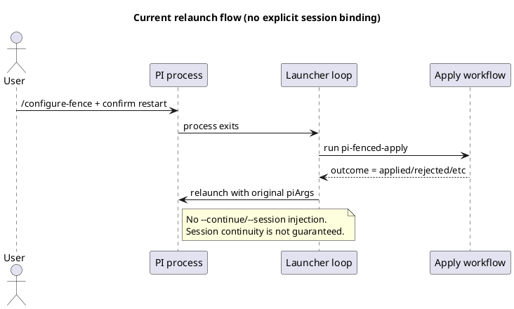
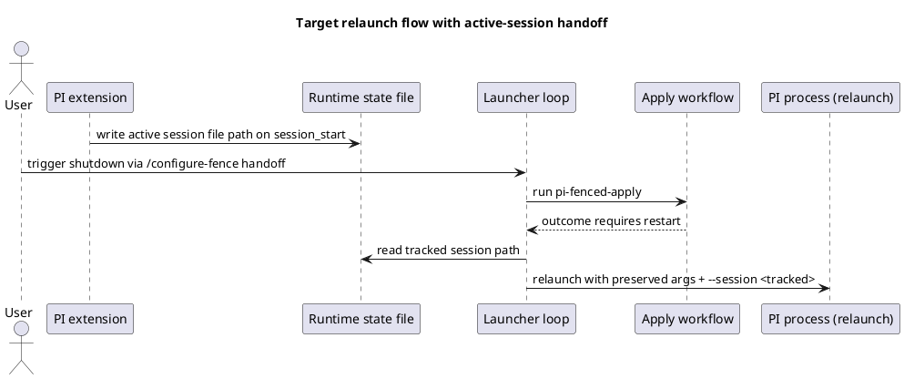

# Task: Relaunch resumes active PI session and preserves launcher options
- **Task Identifier:** 2026-04-26-relaunch-session-resume
- **Scope:**
  Ensure pi-fenced relaunches PI into the same active session after
  external apply outcomes, while preserving launcher mode and user-supplied
  PI launch options.
- **Motivation:**
  During `/configure-fence` external apply handoff, PI is shut down and
  relaunched by the launcher loop. Today this relaunch does not bind to
  the previous active session, so the user may land in a new session and
  lose conversational continuity.
- **Scenario:**
  A user starts `pi-fenced` with model/tool options, works in an
  interactive session, and runs `/configure-fence`. They confirm restart.
  After apply completes, PI relaunches into the same session file that
  was active at shutdown, and all non-session launcher options remain
  unchanged.
- **Constraints:**
  - Keep launcher safety behavior intact (`--without-fence`,
    `--allow-self-modify`, config validation/locking).
  - Preserve existing apply-loop semantics (`no-request` exits;
    non-`no-request` outcomes trigger relaunch).
  - Preserve all non-session PI arguments across relaunch.
  - Do not force session resume when `--no-session` is active.
- **Briefing:**
  Restart logic lives in `launcher/pi-fenced.ts` and launches PI through
  `launcher/run-under-fence.ts`. Extension runtime hooks live in
  `index.ts` and already receive `session_start`. Existing tests cover
  restart-loop argument preservation but do not verify active session
  continuity across relaunch.
- **Research:**
  Verified current behavior:
  1. `runPiFencedWithRestartLoop()` parses args once and relaunches with
     the same `parsed.piArgs` on every iteration.
  2. Relaunch does not inject `--continue` or `--session` automatically.
  3. PI documents `-c/--continue` as an explicit opt-in, implying default
     startup is not guaranteed to resume the prior session.
  4. Existing test
     `runPiFencedWithRestartLoop preserves launcher mode and PI args
     across restart` verifies argument preservation only, not session
     continuity.

- **Design:**
  Add explicit active-session handoff from extension runtime to launcher,
  then rewrite only session-selector args for relaunch.

  1. Add launcher-managed runtime state file path
     (`/tmp/pi-fenced/runtime/active-session.<launcher-pid>.json`) and
     expose it to PI child process via environment variable.
  2. In extension `session_start`, write the current
     `ctx.sessionManager.getSessionFile()` into that state file.
  3. In restart loop, after an apply outcome that requires restart,
     read tracked session path and compute relaunch PI args:
     - preserve all non-session args exactly,
     - remove prior session-selector args (`-c`, `--continue`,
       `-r`, `--resume`, `--session`, `--fork`, plus `=value` forms),
     - prepend `--session <tracked-path>` when tracked path is present,
     - skip session injection when no tracked path exists
       (including `--no-session` runs).
  4. Keep launcher flags/mode unchanged (`withoutFence`, `fenceMonitor`,
     locked config handling, env inheritance).

- **Test specification:**
  - **Automated tests:**
    - Add unit tests for relaunch arg rewriting:
      preserve non-session args and inject tracked `--session`.
    - Add tests for session-selector stripping/replacement behavior.
    - Add no-tracked-session and `--no-session` cases (no injection).
    - Extend restart-loop tests to verify second launch uses tracked
      session while keeping launcher mode/options unchanged.
    - Add extension test verifying `session_start` writes active session
      path to launcher state file when env var is present.
  - **Manual tests:**
    - Start `pi-fenced` with custom model/tools options, converse, run
      `/configure-fence`, approve restart, confirm resumed conversation
      appears in same session history.
    - Repeat with `--without-fence` and confirm launcher mode preserved.
    - Run with `--no-session` and verify restart does not attempt
      session binding.
