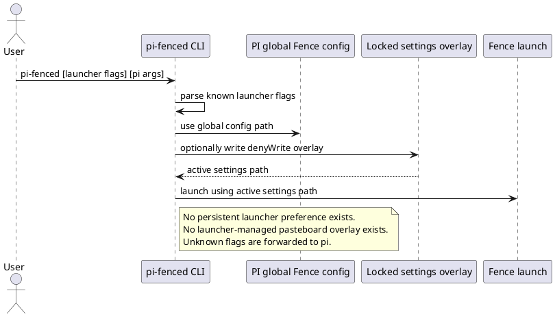
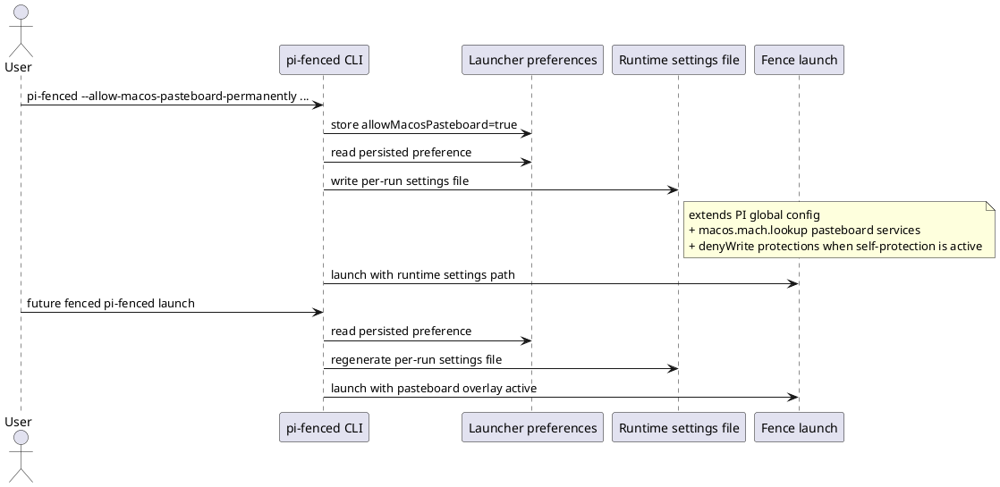

# Task: Persistent macOS pasteboard access option for pi-fenced
- **Task Identifier:** 2026-05-03-pasteboard-option
- **Scope:**
  Add a documented `pi-fenced` launcher option that persistently enables
  launcher-managed macOS pasteboard access for future fenced runs,
  without requiring users to edit Fence JSON manually.
- **Motivation:**
  Clipboard-backed pasteboard access now works under Fence when the right
  `macos.mach.lookup` entries are present, but configuring those values
  manually is error-prone and poorly discoverable. The launcher should
  offer an explicit, persistent opt-in for programmatic pasteboard
  access.
- **Scenario:**
  A macOS user runs `pi-fenced --allow-macos-pasteboard-permanently`
  once. The launcher stores that preference, applies the known
  pasteboard-related `mach.lookup` overlay for the current fenced run,
  and automatically reapplies it on later fenced runs until the user
  explicitly disables it with
  `pi-fenced --disallow-macos-pasteboard-permanently`.
- **Constraints:**
  - This permission is for programmatic macOS pasteboard access, not an
    image-specific feature. Naming, docs, and warnings must avoid
    image-only wording.
  - The opt-in must be expressed as documented `pi-fenced` launcher
    options, not as a PI slash command.
  - The preference must persist outside the global Fence config file so
    launcher-managed policy remains distinct from user-authored Fence
    JSON.
  - Existing launcher safety behavior must stay intact:
    `--without-fence`, `--allow-self-modify`, locked runtime settings,
    config validation, and restart-loop semantics must continue to work.
  - The launcher must inject only the known working macOS pasteboard
    lookup services:
    `com.apple.pasteboard.1`, `com.apple.pbs.fetch_services`,
    `com.apple.coreservices.uasharedpasteboardmanager.xpc`,
    `com.apple.coreservices.uasharedpasteboardaux.xpc`,
    `com.apple.coreservices.uauseractivitypasteboardclient.xpc`, and
    `com.apple.coreservices.uasharedpasteboardprogressui.xpc`.
  - No general launcher-help redesign in this increment. Documentation
    updates are limited to the existing README and related user-facing
    launcher messages.
- **Briefing:**
  Launcher argument parsing lives in `launcher/cli-options.ts`.
  Runtime launch preparation and active settings selection live in
  `launcher/pi-fenced.ts`. The current per-run locked settings overlay
  is built in `launcher/self-protection.ts` and always extends the PI
  global Fence config. Fence path resolution lives in
  `launcher/path-resolution.ts`. Current launcher tests live primarily
  in `tests/launcher-subtask1.test.ts` and
  `tests/launcher-restart-loop-subtask4.test.ts`.
- **Research:**
  Verified current behavior:
  1. `parseLauncherArguments()` recognizes only `--without-fence`,
     `--fence-monitor`, and `--allow-self-modify`; every other flag is
     forwarded to `pi` unchanged.
  2. In fenced mode, `prepareLaunchContext()` selects either the PI
     global Fence config directly or a per-run locked settings overlay
     created by `writeLockedSettingsFile()`.
  3. `writeLockedSettingsFile()` always extends the PI global Fence
     config and only adds `filesystem.denyWrite` protections; there is
     no launcher-managed settings overlay for other runtime policy.
  4. There is no persistent launcher-owned preference store today.
  5. Manual `global.json` edits that add the six macOS pasteboard
     `mach.lookup` values restore fenced clipboard-backed pasteboard
     access. After those entries are present, Pi writes pasted clipboard
     content to `/tmp/fence/pi-clipboard-....png` during fenced runs.
  6. `/show-fence-config` displays the PI global Fence target, not the
     per-run runtime overlay; this is already true for the current
     self-protection settings file.


- **Design:**
  Add a launcher-owned persistent preference plus a launcher-managed
  runtime settings overlay for macOS pasteboard access.

  1. Extend launcher argument parsing with two explicit options:
     `--allow-macos-pasteboard-permanently` and
     `--disallow-macos-pasteboard-permanently`.
     - Reject runs that provide both options in the same invocation.
     - These options are launcher-owned and must not be forwarded to
       `pi`.
  2. Extend resolved launcher paths with a dedicated preferences file at
     `<agentDir>/pi-fenced/preferences.json`.
  3. Introduce a launcher preferences module that reads and writes:

     ```json
     {
       "allowMacosPasteboard": true
     }
     ```

     Missing file means default `false`.
  4. During launch preparation, apply CLI preference mutations before
     selecting the active settings path:
     - `--allow-macos-pasteboard-permanently` stores
       `allowMacosPasteboard: true`.
     - `--disallow-macos-pasteboard-permanently` stores
       `allowMacosPasteboard: false`.
  5. Replace the current single-purpose locked-settings selection with a
     generalized launcher-managed runtime settings flow:
     - base input remains the PI global Fence config,
     - when the stored preference is enabled and the launcher is running
       fenced on macOS, generate a per-run settings overlay that extends
       the PI global config and appends the six known pasteboard
       `macos.mach.lookup` values,
     - when self-protection is active, the same per-run settings file
       also adds the existing `filesystem.denyWrite` protections,
     - when self-protection is disabled but pasteboard access is enabled,
       still use the per-run settings file so the macOS overlay applies
       without mutating `global.json`.
  6. Protect the launcher preferences file with the same fenced
     self-protection write lock as the launcher project root and Fence
     config files, unless `--allow-self-modify` is active.
  7. Emit clear launcher warnings when the persistent preference is
     changed and when macOS pasteboard access is active for the current
     fenced run.
  8. Update README launcher documentation to describe the new persistent
     option, its security meaning, and the exact enable/disable flag
     names.


- **Test specification:**
  - **Automated tests:**
    - `parseLauncherArguments()` recognizes the two new launcher flags,
      strips them from forwarded PI args, and rejects conflicting
      enable+disable usage.
    - path resolution returns the launcher preferences file path.
    - launcher preferences read/write handles missing file, `true`, and
      `false` states.
    - launch preparation persists preference mutations before active
      settings selection.
    - fenced launch preparation uses a per-run settings file when
      pasteboard access is enabled, both with and without
      self-protection.
    - generated runtime settings JSON contains the six exact
      `macos.mach.lookup` values and existing `filesystem.denyWrite`
      protections when both apply.
    - self-protection protected-write paths include the launcher
      preferences file path.
    - restart-loop launches continue to honor the persisted preference on
      later launches.
  - **Manual tests:**
    - on macOS, run
      `pi-fenced --allow-macos-pasteboard-permanently --model <provider/model>`
      and verify fenced clipboard-backed pasteboard access works without
      editing `~/.pi/agent/fence/global.json`.
    - restart `pi-fenced` without the flag and verify the preference is
      still active for fenced runs.
    - run
      `pi-fenced --disallow-macos-pasteboard-permanently --model <provider/model>`
      and verify the launcher stops applying the macOS pasteboard overlay
      on later fenced runs.
