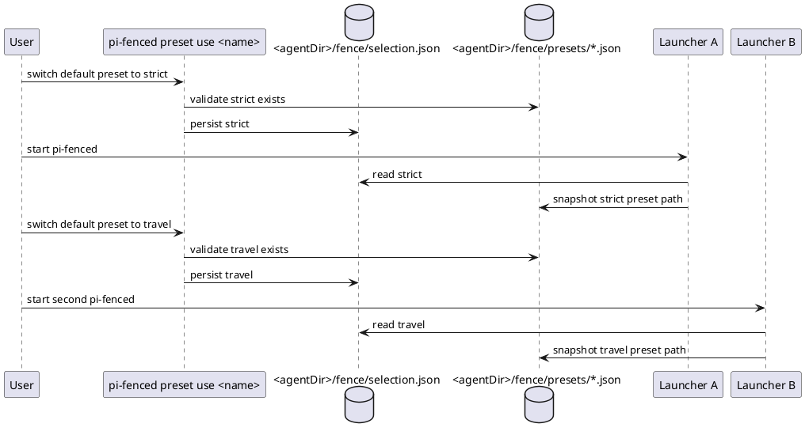

# Task: Global Fence presets and launcher preset selection
- **Task Identifier:** 2026-05-14-global-presets
- **Scope:**
  Design support for multiple named global Fence presets stored under
  the PI agent Fence directory, with a launcher-managed command to list
  and permanently switch the active preset.
- **Motivation:**
  A single mutable global config makes it awkward to keep several safe
  long-lived policy baselines and move between them without hand edits
  or in-session configuration churn.
- **Scenario:**
  User keeps several global presets under
  `<agentDir>/fence/presets`, for example
  `default-configuration.json` and `travel.json`. They launch
  one `pi-fenced` session using one preset, permanently switch the
  default preset, then launch another `pi-fenced` session in parallel.
  The first launcher run keeps using the preset it resolved at startup,
  including across automatic restarts for configuration changes, while
  the second run uses the newly selected preset. PI itself remains
  unable to modify the preset directory during normal fenced runs.
- **Constraints:**
  - Preset files must live under `<agentDir>/fence/presets`.
  - Launcher-owned preset selection metadata must live outside that
    preset directory.
  - Active preset selection must persist across launcher runs.
  - The whole `<agentDir>/fence` directory should be deny-written from
    PI during normal fenced runs, not only one config file.
  - Launcher must provide an explicit user-facing preset-management
    command or subcommand.
  - Parallel `pi-fenced` sessions must be able to run with different
    global presets at the same time.
  - Persistent preset switching must affect future fresh launches only;
    it must not retarget already running launcher sessions.
  - Automatic restarts for configuration changes must preserve the
    preset that the launcher run originally started with, even after
    the default preset changes.
  - The active preset for a launcher run must be resolved per launch,
    not through a shared mutable launcher entrypoint file.
  - Current global-only behavior must keep a deterministic active
    config path for Fence launch and validation.
  - The design should remain compatible with later workspace/session
    overlays.
  - Preset switching is launcher-managed work, not in-PI mutable state.
  - Unfenced `yolo` mode must not include preset names in the footer
    status label.
- **Briefing:**
  Current runtime assumes one launcher-selected global config target.
  Bootstrap, launch, self-protection, `/configure-fence`, and
  external apply all depend on that assumption. Adding presets affects
  file layout, bootstrap ownership, protected paths, launcher CLI
  surface, and the definition of what “global” means for future
  `/configure-fence` work.
- **Research:**
  Verified current implementation facts:
  - `launcher/path-resolution.ts` currently resolves Fence base,
    `<agentDir>/fence`, the default preset path, `selection.json`,
    and launcher preferences paths.
  - The current preset implementation stores
    `default-configuration.json` and `selection.json` side by side
    under `<agentDir>/fence`.
  - `launcher/bootstrap-configs.ts` bootstraps Fence base plus a
    default preset and launcher-owned selection metadata.
  - `launcher/self-protection.ts` can protect the whole
    `<agentDir>/fence` directory and extend a locked runtime overlay
    from the selected preset path.
  - `launcher/cli-options.ts` supports preset-management subcommands.
  - `launcher/run-under-fence.ts` already launches Fence with any
    supplied `configPath`, so selected preset files can be launched
    directly.
  - `launcher/config-guard.ts` already validates any supplied
    `configPath`, so selected preset files can be validated directly.
  - Existing launcher restart/session work already preserves state
    across automatic relaunch for configuration changes, so preset
    pinning within one launcher run builds on that mechanism.
  - `design.md` and current runtime architecture still treat global
    scope as one active config target per launcher run.
  - User feedback for this increment is that launcher metadata and
    user-owned preset files must not share one directory namespace.

- **Design:**
  Final decisions from current discussion:
  1. Store all global presets in `<agentDir>/fence/presets`.
  2. Keep launcher-owned preset selection metadata in
     `<agentDir>/fence/selection.json`, outside the preset directory.
  3. Protect the entire `<agentDir>/fence` directory from PI writes in
     normal fenced mode.
  4. Add launcher preset commands:
     - `pi-fenced preset list`
     - `pi-fenced preset current`
     - `pi-fenced preset use <name>`
  5. Do not keep a shared mutable launcher entrypoint file once
     presets exist.
  6. Persist default preset selection in launcher-owned metadata
     outside the preset directory.
  7. Preserve original preset identity across launcher-controlled
     restart chains.

  Recommended file layout:
  - `<agentDir>/fence/selection.json`
  - `<agentDir>/fence/presets/default-configuration.json`
  - `<agentDir>/fence/presets/<other-preset>.json`

  Preset model:
  - Every preset file is a first-class named global config.
  - Preset names are file-basename identifiers within
    `<agentDir>/fence/presets`.
  - `selection.json` stores the launcher-managed default preset name
    for future fresh launches.
  - `preset use <name>` updates only `selection.json`; it does not edit
    preset content.
  - `/configure-fence` global updates target the preset already
    resolved for the active launcher run, so the proposed change and
    the post-apply restart use the same global preset.

  Launch model:
  - On each fresh launcher start, pi-fenced resolves the effective
    preset from `selection.json`.
  - On launcher-controlled automatic restart, pi-fenced reuses the
    preset already resolved for that launcher run, not the current
    default in `selection.json`.
  - The resolved preset path is then fixed for that launcher run.
  - Launcher records that active preset path in a per-run
    active-launch-state file so the extension targets the same preset
    for `/configure-fence` and `/show-fence-config`.
  - In unlocked mode, launcher may launch Fence directly with the
    selected preset path.
  - In locked mode, the generated runtime overlay under
    `/tmp/pi-fenced/runtime` extends the selected preset path.
  - Changing `selection.json` later affects only future fresh launches,
    not already running sessions or automatic restarts.
  - This per-launch resolution allows parallel sessions to use
    different global presets safely.

  Bootstrap:
  - Bootstrapping must create the preset directory when missing.
  - Bootstrapping must create a default preset under that directory
    when missing.
  - Bootstrapping must initialize launcher-owned selection metadata
    when missing.

  Exact target path inventory:
  - Fence root directory: `<agentDir>/fence`
  - Launcher metadata: `<agentDir>/fence/selection.json`
  - Preset directory: `<agentDir>/fence/presets`
  - Default preset:
    `<agentDir>/fence/presets/default-configuration.json`

  Structural impact areas:
  - `launcher/path-resolution.ts`
    - resolve Fence root directory, preset directory, default preset
      path, and selection metadata path explicitly.
  - `launcher/global-presets.ts`
    - own preset-name parsing, selection metadata, and active preset
      resolution.
  - `launcher/bootstrap-configs.ts`
    - bootstrap `fence/presets` inventory separately from
      `selection.json`.
  - `launcher/self-protection.ts`
    - protect whole `<agentDir>/fence` directory explicitly,
    - extend lock overlay from the selected preset path.
  - `launcher/cli-options.ts` and launcher entrypoint
    - support preset subcommands for `list`, `current`, and `use`
      only.
  - `launcher/pi-fenced.ts`
    - resolve selected preset per launch,
    - preserve selected preset across automatic restarts,
    - validate that preset directly,
    - launch Fence against the selected preset or a runtime overlay
      extending it.
  - `launcher/active-launch-state.ts`
    - carry active preset path alongside session continuity for the
      current launcher run.
    - replace stale `session`/`tracked` naming with `launch`-based
      naming across helpers, environment variables, and callers.
  - `index.ts` and apply modules
    - treat the active launch preset as the `/configure-fence` global
      target,
    - constrain global apply targets to files inside
      `<agentDir>/fence/presets`,
    - show footer status as `🔒 fence` for the default preset and as
      `🔒 fence <presetName>` for any non-default preset,
      using the active-launch-state preset pin,
    - keep unfenced footer status as plain `yolo`,
    - keep restart on the same resolved preset after apply.

  Out of scope for this increment:
  - preset creation, rename, and deletion commands;
  - per-launch preset override.
- **Test specification:**
  - **Automated tests:**
    - path resolution exposes Fence root, preset directory, default
      preset, and selector paths;
    - bootstrap creates default preset inventory correctly;
    - self-protection covers the full `<agentDir>/fence` directory;
    - launcher preset commands list current presets and persist active
      selection;
    - fresh launch path resolves the selected preset deterministically;
    - `/configure-fence` global requests target the preset resolved for
      the active launcher run;
    - footer status shows the preset name only for fenced non-default
      presets, never for `yolo` mode;
    - automatic restart preserves the originally selected preset even
      after default selection changes;
    - locked runtime overlay extends the selected preset path;
    - changing `selection.json` after one launcher starts does not
      affect that already running launcher session;
    - active-launch-state naming is used consistently across launcher,
      extension, and tests.
  - **Manual tests:**
    - create two presets in `<agentDir>/fence/presets`, switch to one,
      launch
      pi-fenced, switch to the other, launch a second pi-fenced in
      parallel, and verify each session uses its own selected preset;
    - change the default preset while one launcher run is active,
      trigger `/configure-fence` + automatic restart, and verify that
      run still updates and relaunches with its original preset;
    - confirm PI cannot modify files under `<agentDir>/fence` during
      normal fenced runs.
