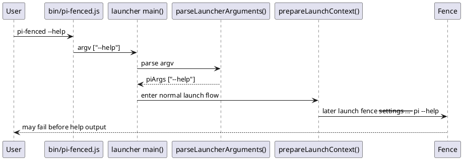
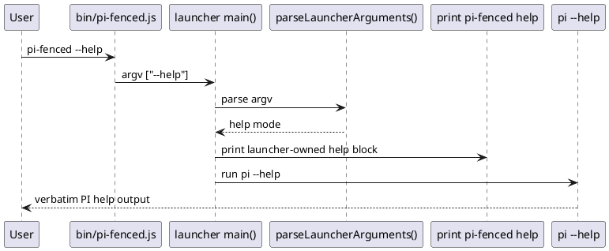

# Task: pi-fenced help output includes launcher and pi help
- **Task Identifier:** 2026-05-14-help-output
- **Scope:**
  Add a launcher-owned `--help` path so `pi-fenced --help` prints
  pi-fenced usage first, then `pi --help`, and exits without entering
  the normal launch/apply loop.
- **Motivation:**
  `pi-fenced --help` is currently documented as an installation
  verification step, but the launcher still tries to bootstrap and run
  the fenced runtime before any help is shown. That makes a basic help
  request fail on systems where Fence is unavailable or sandbox launch
  is blocked, and it hides launcher-specific options from users.
- **Scenario:**
  User runs `pi-fenced --help` from a shell before starting a session.
  The command prints pi-fenced launcher help, including launcher-only
  flags and preset commands, then prints the current `pi --help`
  output, and exits with no bootstrap, Fence validation, or PI session
  launch side effects.
- **Constraints:**
  - Combined help must preserve PI's own help text order after the
    launcher-owned help block.
  - Help mode must not create bootstrap files, locked runtime overlay
    files, or active launch state files.
  - Help mode must not invoke Fence or enter the restart/apply loop.
  - `--` must keep its current pass-through meaning, so
    `pi-fenced -- --help` remains a direct PI help request rather than
    launcher help mode.
  - Existing preset subcommands and normal argument forwarding must
    stay unchanged when help mode is not selected.
- **Briefing:**
  The launcher currently parses only preset commands as launcher-owned
  top-level commands. All other unrecognized arguments are forwarded to
  PI, but that forwarding happens only after bootstrap,
  self-protection, config validation, and the launch loop are
  prepared. The help change is a small CLI-behavior increment centered
  in `launcher/cli-options.ts`, `launcher/pi-fenced.ts`, and entrypoint
  tests.
- **Research:**
  Verified current implementation facts:
  - `parseLauncherArguments()` in `launcher/cli-options.ts` recognizes
    only preset commands and a fixed set of launcher flags. Any other
    token, including `--help`, is appended to `piArgs`.
  - `main()` in `launcher/pi-fenced.ts` special-cases preset commands
    only. All non-preset invocations go through
    `runPiFencedWithRestartLoop()`.
  - `runPiFencedWithRestartLoop()` calls `prepareLaunchContext()`,
    which bootstraps config files, updates launcher preferences, may
    generate a locked runtime settings file, and initializes active
    launch state before PI is launched.
  - `launchSinglePiSession()` validates Fence config and then launches
    either `fence --settings <config> -- pi ...` or `pi ...`
    depending on launcher mode.
  - Local verification on 2026-05-14: `node ./bin/pi-fenced.js --help`
    attempted the normal fenced launch path and failed with
    `sandbox-exec: sandbox_apply: Operation not permitted` before any
    help text was printed.
  - `pi --help` currently prints the full PI CLI help to stdout and
    exits successfully in this environment.
  - README installation verification already tells users to run
    `pi-fenced --help`, but README does not describe a launcher-owned
    help block today.

- **Design:**
  Final decisions for this increment:
  1. Treat `--help` as a launcher-owned top-level help request when it
     appears before the optional `--` separator.
  2. Keep `pi-fenced -- --help` as a pure PI pass-through request.
  3. Print a pi-fenced-specific help block first, then invoke
     `pi --help` and stream its output verbatim.
  4. Exit help mode without bootstrap, self-protection, active launch
     state initialization, Fence validation, PI session launch, or
     apply-loop processing.
  5. If the `pi` help subprocess cannot be started or exits non-zero,
     propagate that exit status after the launcher help block is
     printed.

  Target CLI behavior:
  - `pi-fenced --help`
    - prints launcher usage, launcher options, preset commands, and
      forwarding notes;
    - prints a blank-line separator;
    - then prints `pi --help` output exactly as produced by `pi`;
    - exits with the `pi --help` exit code.
  - `pi-fenced -- --help`
    - remains equivalent to launching PI with `--help` directly through
      the existing pass-through flow.
  - `pi-fenced preset ...`
    - remains handled before normal launcher startup and is unchanged
      by this increment.

  Launcher help content inventory:
  - Usage:
    - `pi-fenced [launcher options] [--] [pi args...]`
    - `pi-fenced preset list`
    - `pi-fenced preset current`
    - `pi-fenced preset use <name>`
  - Launcher options listed in the local help block:
    - `--help`
    - `--fence-monitor`
    - `--without-fence`
    - `--allow-self-modify`
    - `--allow-macos-pasteboard-permanently`
    - `--disallow-macos-pasteboard-permanently`
  - Forwarding note: all remaining args are forwarded to `pi`, and
    `--` forces the remaining tokens to be treated as PI args.

  Planned code changes:
  - `launcher/cli-options.ts`
    - detect launcher help mode before normal pass-through collection,
      only for `--help` before the `--` separator;
    - expose that decision in the parsed argument result without
      disturbing existing preset command parsing or normal `piArgs`
      forwarding.
  - `launcher/pi-fenced.ts`
    - add a help path that prints the launcher-owned help block and
      then runs `pi --help`;
    - route `main()` through that help path before launch-loop setup,
      while preserving the current preset-command branch;
    - keep normal launch behavior unchanged when help mode is not
      selected.
  - `bin/pi-fenced.js`
    - no logic change expected; it continues delegating to
      `launcher/pi-fenced.ts`.
  - `README.md`
    - document that `pi-fenced --help` prints launcher help followed by
      PI help.

- **Test specification:**
  - **Automated tests:**
    - `parseLauncherArguments()` marks `--help` before `--` as
      launcher help mode and keeps `piArgs` empty for that request.
    - `parseLauncherArguments()` keeps `--help` after `--` inside
      `piArgs` so pass-through behavior is preserved.
    - `main(["--help"])` prints pi-fenced help first, then PI help,
      and exits 0 without calling bootstrap, self-protection, config
      validation, launch, or apply helpers.
    - the help path propagates a non-zero exit code when the `pi`
      help subprocess fails.
    - existing preset command tests still pass unchanged.
    - bin-level CLI test verifies `bin/pi-fenced.js --help` resolves
      the loader from an external cwd and emits help text instead of
      entering the normal launcher path.
  - **Manual tests:**
    - run `pi-fenced --help` on a machine with normal PI installation
      and confirm the output starts with pi-fenced-specific launcher
      help and ends with the current `pi --help` output.
    - run `pi-fenced -- --help` and confirm only PI help behavior is
      used.
    - run `pi-fenced preset list` and a normal launcher invocation such
      as `pi-fenced -- --version` to confirm non-help behavior is
      unchanged.
