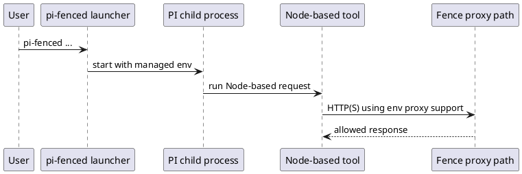

# Task: launcher sets Node proxy opt-in for managed PI sessions
- **Task Identifier:** 2026-05-16-launcher-node-proxy-env
- **Status:** done
- **Scope:**
  Update the launcher-owned PI child environment so Node-based tools in
  launcher-managed sessions use proxy environment variables without
  requiring a manual `NODE_USE_ENV_PROXY=1` export.
- **Motivation:**
  In the current fenced runtime, DNS and HTTPS are reachable through
  Fence's proxy path, but Node HTTP clients still fail unless the user
  manually opts Node into proxy-env handling first.
- **Scenario:**
  A user starts `pi-fenced` and then runs a Node-based tool inside PI
  that uses `fetch` or the built-in HTTP(S) stack to reach an allowed
  remote host. The request succeeds without any manual shell export of
  `NODE_USE_ENV_PROXY=1` before launching PI.
- **Constraints:**
  - Keep `PI_FENCED_LAUNCHER=1` behavior unchanged.
  - Preserve an explicit caller-provided `NODE_USE_ENV_PROXY` value if
    one is already set.
  - The launcher change only covers Node proxy-env support for HTTP(S)
    traffic; it does not promise to fix raw `node:dns` lookups or other
    direct-socket clients.
  - Existing fenced and unfenced launcher mode selection must remain
    unchanged.
- **Briefing:**
  `launcher/run-under-fence.ts` centralizes construction of the child
  process environment for both fenced and unfenced launcher-managed PI
  runs. That is the smallest shared boundary for a launcher-owned fix.
- **Research:**
  Verified current implementation and runtime facts:
  - `buildLaunchSpec()` in `launcher/run-under-fence.ts` currently adds
    only `PI_FENCED_LAUNCHER=1` to the child environment.
  - The launcher uses that same environment object for both fenced and
    unfenced managed PI launches.
  - In this sandbox, direct Node `fetch("https://skills.sh/...")`
    failed with `ENOTFOUND` until `NODE_USE_ENV_PROXY=1` or
    `node --use-env-proxy` was used.
  - With `NODE_USE_ENV_PROXY=1`, Node `fetch()` reached `skills.sh` and
    `github.com` successfully in this environment.
  - Raw `node:dns`.lookup still failed after setting
    `NODE_USE_ENV_PROXY=1`, so the launcher fix should be scoped to
    proxy-aware HTTP(S) behavior only.

- **Design:**
  Final decisions for this increment:
  1. `launcher/run-under-fence.ts` will default
     `NODE_USE_ENV_PROXY=1` in the launcher-managed PI child
     environment.
  2. If the caller already provided `NODE_USE_ENV_PROXY`, the launcher
     will preserve that explicit value instead of overwriting it.
  3. The defaulting behavior will apply to both fenced and unfenced
     launcher-managed PI runs because both paths share the same launch
     environment builder and the opt-in is inert unless proxy env vars
     are present.
  4. No launcher CLI flags, preset behavior, or apply-loop flow change
     in this increment.
  5. Externally meaningful identifier introduced by this change:
     - `NODE_USE_ENV_PROXY=1` in the launcher-managed PI child env.

  Planned code changes:
  - `launcher/run-under-fence.ts`
    - default `NODE_USE_ENV_PROXY` in the child env construction while
      preserving any caller-provided value.
  - `tests/launcher-subtask1.test.ts`
    - cover fenced launch env defaulting,
    - cover unfenced launch env defaulting,
    - cover explicit caller override preservation.

- **Test specification:**
  - **Automated tests:**
    - `buildLaunchSpec()` adds `NODE_USE_ENV_PROXY=1` when the caller
      did not set it for a fenced launch.
    - `buildLaunchSpec()` adds `NODE_USE_ENV_PROXY=1` when the caller
      did not set it for an unfenced launch.
    - `buildLaunchSpec()` preserves a caller-provided
      `NODE_USE_ENV_PROXY` value.
  - **Manual tests:**
    - launch `pi-fenced`, run a small Node `fetch()` call to an allowed
      host, and confirm it succeeds without manually exporting
      `NODE_USE_ENV_PROXY` first.
    - confirm a direct `node:dns` reproduction is unchanged so the
      launcher fix does not overclaim scope.
