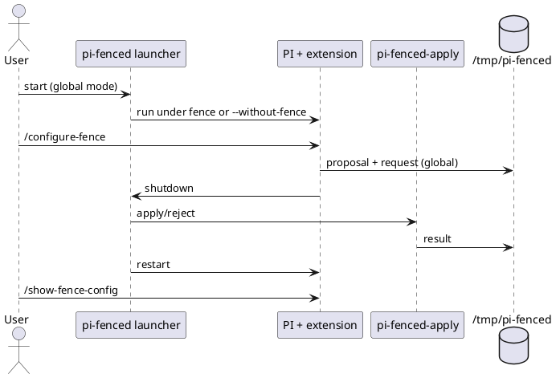
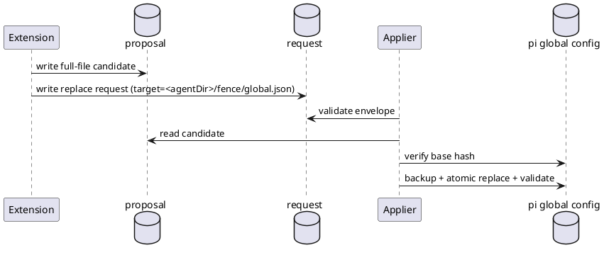

# Task: Global-scope pi-fenced runtime with external configuration apply
- **Task Identifier:** 2026-04-21-fence-workflow
- **Status:** done
- **Scope:**
  Build `pi-fenced` as a launcher-managed runtime for PI with three
  cooperating parts for global scope only: launcher (`pi-fenced`),
  external applier (`pi-fenced-apply`), and in-PI
  `/configure-fence` proposal flow.
- **Motivation:**
  Keep one operational entrypoint (`pi-fenced`) and safe,
  outside-of-PI policy mutation with apply/reject/rollback.
- **Scenario:**
  User runs PI through `pi-fenced`. During a session, user asks
  `/configure-fence` for a policy change. PI creates a proposal +
  request in `/tmp/pi-fenced` and exits. Launcher runs external
  apply/reject flow. On apply, global config is updated atomically,
  then PI restarts.
- **Constraints:**
  - Current implementation scope is **global config only**.
  - Active global target for this task is:
    `<agentDir>/fence/global.json`.
  - `agentDir` follows PI agent-dir semantics:
    - use `PI_CODING_AGENT_DIR` when set,
    - otherwise default to `~/.pi/agent`.
  - Bootstrap chain policy:
    - ensure Fence base file `~/.config/fence/fence.json` exists;
      create with `{"extends":"code"}` when missing,
    - ensure `<agentDir>/fence/global.json` exists; create with
      `{"extends":"@base"}` when missing.
  - Global config may use Fence `extends` with any Fence-supported
    value.
  - Direct manipulation of active Fence config files from inside PI
    runtime is forbidden by default; normal mutation path is
    proposal/request + external apply.
  - Extension must refuse unmanaged runtime (outside `pi-fenced`).
  - Launcher supports fenced mode (default) and explicit unfenced mode
    (`--without-fence`).
  - Launcher supports `--fence-monitor` in fenced mode.
  - Launcher forwards remaining arguments to `pi`.
  - Request conflict policy: if more than one pending request exists,
    drop all pending requests + linked proposals, warn loudly, then
    continue.
  - Temporary control artifacts live under `/tmp/pi-fenced`.
  - Self-protection lock must deny writes to the full package root for
    the active launcher installation.
  - Locked runtime settings file must be per-run unique to avoid
    collisions across parallel launcher runs.
- **Briefing:**
  Existing architecture notes are in `../pi-fenced/design.md`.
  Deferred multi-scope design (session/workspace selection and chain
  policy) has been moved to:
  `../pi-fenced/tasks/backlog/multi-scope-configuration-chain-and-policy-reconciliation.md`.
- **Research:**
  Verified current state:
  - Extension scaffold exists and currently uses a scope-selection LLM
    step.
  - Launcher and applier CLIs are not implemented yet.
  - Fence validation command exists:
    `fence config show --settings <file>`.
  - Current request envelope already supports replace-only apply via
    proposal file + `baseSha256`.

- **Design:**
  Deliver a global-only vertical slice first. Defer session/workspace
  semantics to a separate backlog task.

  Global-only behavior:
  - Target path is always `<agentDir>/fence/global.json`.
  - No scope-selection tool call in this task.
  - Mutation proposal remains structured (`write`/`edit`), but final
    proposal artifact is full-file content.
  - Extension adds `/show-fence-config` command that executes
    `fence config show --settings <agentDir>/fence/global.json` and
    displays output verbatim in chat.

  Bootstrap behavior:
  - Ensure `~/.config/fence/fence.json` exists; create with
    `{"extends":"code"}` when missing.
  - Ensure `<agentDir>/fence/global.json` exists; create with
    `{"extends":"@base"}` when missing.

  Request/apply model:
  - Request envelope still uses `mutationType: "replace"`.
  - Applier validates base hash, validates proposal with Fence,
    presents unified diff, and performs atomic replace with rollback.

- **Test specification:**
  - Subtask-specific test plans are defined per subtask below.
  - Before moving to next subtask, local tests for implemented scope
    must pass.

## Subtask: Implement `pi-fenced` launcher for global scope
- **Status:** done
- **Scope:**
  Add launcher CLI that starts PI in launcher-managed fenced/unfenced
  modes, forwards PI args, resolves `agentDir`, ensures global bootstrap
  files, and uses pi global config path in fenced mode.
- **Motivation:**
  Establish the mandatory launcher entrypoint and runtime mode control
  first.
- **Scenario:**
  User launches `pi-fenced [options] -- <pi-args>` and PI starts with
  `PI_FENCED_LAUNCHER=1`.
- **Constraints:**
  - `--without-fence` bypasses Fence.
  - `--fence-monitor` is ignored in `--without-fence` mode with
    warning.
  - PI args pass-through must be lossless.
- **Briefing:**
  This subtask intentionally does not implement session/workspace
  selection.
- **Research:**
  - Fence invocation form is:
    `fence [-m] --settings <config> -- pi <args...>`.
  - PI agent dir supports env override via `PI_CODING_AGENT_DIR` and
    defaults to `~/.pi/agent`.
  - Fence base default path is `~/.config/fence/fence.json`.
- **Design:**
  Proposed modules:
  - `launcher/cli-options.ts`
  - `launcher/path-resolution.ts` (agentDir + global target paths)
  - `launcher/bootstrap-configs.ts`
  - `launcher/config-guard.ts`
  - `launcher/run-under-fence.ts`
  - `launcher/pi-fenced.ts` (entrypoint)

  Launch contract:
  - CLI shape: `pi-fenced [launcher-options] [-- <pi-args...>]`
  - Resolve `agentDir` from `PI_CODING_AGENT_DIR` or `~/.pi/agent`.
  - Ensure bootstrap files:
    - `~/.config/fence/fence.json` (create `{"extends":"code"}` if
      missing)
    - `<agentDir>/fence/global.json` (create `{"extends":"@base"}` if
      missing)
  - Fenced mode:
    `fence [-m] --settings <agentDir>/fence/global.json -- pi <pi-args>`
  - Unfenced mode:
    `pi <pi-args>`
  - Always set `PI_FENCED_LAUNCHER=1`.
- **Test specification:**
  - **Automated tests:**
    - launcher option parsing tests,
    - launch spec construction tests,
    - global config validation behavior tests.
  - **Manual tests:**
    - fenced launch with monitor,
    - unfenced launch with monitor-warning,
    - PI arg pass-through smoke test.

## Subtask: Implement global-only external apply command
- **Status:** done
- **Scope:**
  Build `pi-fenced-apply` for pi global target only
  (`<agentDir>/fence/global.json`).
- **Motivation:**
  Deliver safe apply/reject/rollback without scope complexity.
- **Scenario:**
  Applier validates request/proposal, prompts apply/reject, updates
  global config atomically on apply.
- **Constraints:**
  - Replace-only apply.
  - Unified diff for review.
  - Backup + rollback on failure.
- **Briefing:**
  Reuse current envelope fields; enforce pi global target path.
- **Research:**
  - Request/proposal artifacts already defined by extension scaffold.
  - No result artifact currently implemented.
- **Design:**
  Proposed modules:
  - `apply/pi-fenced-apply.ts`
  - `apply/request-contract.ts`
  - `apply/global-path-policy.ts`
  - `apply/atomic-apply.ts`
  - `apply/outcome.ts`

  Conflict policy:
  - If count(request-*.json) > 1:
    - drop all request files,
    - drop linked proposal files,
    - emit warning summary,
    - return control to launcher loop.
- **Test specification:**
  - **Automated tests:**
    - request schema validation,
    - base hash mismatch,
    - apply success,
    - rollback on failure,
    - multi-request cleanup behavior.
  - **Manual tests:**
    - interactive apply/reject,
    - conflict cleanup demonstration.

## Subtask: Complete global-only `/configure-fence` extension flow
- **Status:** done
- **Scope:**
  Remove scope-selection step for this task and always target
  `<agentDir>/fence/global.json`. Add `/show-fence-config` command for
  transparent effective-config inspection.
- **Motivation:**
  Reduce prompt/tool complexity for v1.
- **Scenario:**
  User requests change, extension produces global proposal/request,
  confirms, and optionally shuts down.
- **Constraints:**
  - Require launcher runtime (`PI_FENCED_LAUNCHER=1`).
  - Outside launcher: warn + graceful shutdown.
  - Allow any Fence-supported `extends` value.
- **Briefing:**
  Prompt templates should be file-based and explicit.
- **Research:**
  - Existing scope-decision tool and prompt are currently wired.
  - Mutation proposal tooling is already present.
- **Design:**
  - Keep mutation proposal tool.
  - Remove scope-decision tool call from command flow.
  - Hardcode global target path `<agentDir>/fence/global.json`.
  - Add `/show-fence-config` command:
    - execute `fence config show --settings <agentDir>/fence/global.json`
    - display output verbatim (stderr chain + stdout effective JSON)
    - no custom pager/collapsible UI in v1.
  - Keep template files:
    - `prompts/configure-fence/mutation-proposal.prompt.txt`
- **Test specification:**
  - **Automated tests:**
    - runtime guard behavior,
    - global request envelope fields,
    - extends-allowed config validation,
    - `/show-fence-config` command output handling.
  - **Manual tests:**
    - launcher-managed run,
    - unmanaged refusal run,
    - real global request creation,
    - `/show-fence-config` returns verbatim Fence output.

## Subtask: Wire launcher/applier restart loop (global-only)
- **Status:** done
- **Scope:**
  Implement PI exit -> request handling -> restart loop for global-only
  flow.
- **Motivation:**
  Complete operational lifecycle.
- **Scenario:**
  PI exits after configure request, launcher applies/rejects externally,
  then restarts PI.
- **Constraints:**
  - No silent auto-apply.
  - Missing/malformed files must not crash loop.
- **Briefing:**
  Reuse conflict cleanup policy from apply subtask.
- **Research:**
  - Loop not implemented yet.
  - Existing extension already supports optional `ctx.shutdown()`.
- **Design:**
  - Loop handles at most one valid request cycle per PI exit.
  - Multi-request detected -> cleanup then continue.
  - Preserve launcher mode and PI args across restart.
- **Test specification:**
  - **Automated tests:**
    - no-request path,
    - single-request path,
    - malformed-request resilience,
    - mode/arg preservation.
  - **Manual tests:**
    - end-to-end apply and reject.

## Subtask: Protect control-plane and active config artifacts behind explicit unlock option
- **Status:** done
- **Scope:**
  Add runtime self-protection so launcher/applier artifacts and active
  Fence config files cannot be directly modified by agent activity
  unless an explicit launcher unlock option is enabled.
- **Motivation:**
  Prevent self-tampering of enforcement/control-plane components and
  bypass of external-apply ownership.
- **Scenario:**
  User runs `pi-fenced` normally and the agent attempts to write
  launcher/applier artifacts or active Fence config files. Writes are
  blocked by default. User can opt into maintenance mode with a
  dedicated unlock flag when intentional local development requires it.
- **Constraints:**
  - Default behavior must be deny-by-default.
  - Unlock must be explicit and per-launch, with loud warning.
  - Protection must cover all write paths (not only edit/write tools).
  - Active config writes remain external-apply-only in normal mode.
  - Behavior must be deterministic in both fenced and
    `--without-fence` launcher modes.
- **Briefing:**
  Build on existing launcher option parsing and apply/restart loop
  ownership boundaries.
- **Research:**
  - Current implementation has no explicit self-protection for launcher
    artifacts or active config file paths.
  - Effective protection must include shell command write attempts.
- **Design:**
  - Add launcher option: `--allow-self-modify` (name can be revised
    before implementation if needed).
  - Compute protected paths with normalized absolute checks, including:
    - launcher/applier artifacts (`launcher/**`, `apply/**`),
    - `<agentDir>/fence/global.json`,
    - `~/.config/fence/fence.json`.
  - Fenced mode:
    - enforce deny-write policy for protected paths during PI runtime.
  - Unfenced mode:
    - refuse startup unless `--allow-self-modify` is explicitly set.
  - External applier remains allowed to mutate active config outside
    fenced PI runtime.
  - **Option 2 selected:** unlock flag enables direct writes to both
    control-plane artifacts and active config paths for that launch.
  - When unlock flag is active, emit prominent warning at startup.
- **Test specification:**
  - **Automated tests:**
    - default mode blocks protected-path write attempts,
    - direct writes to active config paths are blocked in normal mode,
    - unlock flag allows protected-path writes,
    - `--without-fence` without unlock is refused,
    - path normalization prevents bypass via relative segments.
  - **Manual tests:**
    - attempt launcher/applier and active-config modification from PI
      tools in locked mode,
    - verify `/configure-fence` + external apply still updates global
      config in locked mode,
    - repeat in unlocked mode and verify intentional edits work.

## Subtask: Document global-only operations and recovery
- **Status:** done
- **Scope:**
  Document launcher usage, apply flow, conflict cleanup behavior, and
  failure recovery for global-only implementation.
- **Motivation:**
  Make operations predictable for daily usage.
- **Scenario:**
  Operator can recover from stale hash, invalid proposal, or apply
  failure quickly.
- **Constraints:**
  - Docs must match implemented behavior exactly.
- **Briefing:**
  Keep user-facing operational documentation centralized in README.
- **Research:**
  - Current README is scaffold-level.
- **Design:**
  - `README.md`: usage, CLI flags, bootstrap chain, request/apply flow,
    outcomes, and recovery guidance.
- **Test specification:**
  - **Automated tests:** N/A
  - **Manual tests:**
    - verify documented commands against local behavior.

## Subtask: Harden self-protection scope and per-run lock file isolation
- **Status:** done
- **Scope:**
  Expand default self-protection from selected subdirectories to the
  full `pi-fenced` package root, and switch locked settings output to a
  per-run unique filename to support parallel launcher runs.
- **Motivation:**
  Ensure self-modify lock semantics match user expectations and avoid
  startup collisions when multiple launcher instances run concurrently.
- **Scenario:**
  User runs two `pi-fenced` sessions in parallel (for example with
  project and global package setups). Each run gets its own locked
  settings file and both enforce deny-write over the full package root
  plus active config paths.
- **Constraints:**
  - Default mode remains deny-by-default.
  - Unlock behavior with `--allow-self-modify` must stay unchanged.
  - Runtime settings filename must be unique per run.
- **Briefing:**
  Keep the restart loop contract unchanged; only self-protection path
  computation and locked settings filename generation should change.
- **Research:**
  - Current lock file path is static:
    `/tmp/pi-fenced/runtime/launcher-locked-settings.json`.
  - Current protected paths include `launcher/**` and `apply/**` but not
    the whole package root.
- **Design:**
  - `launcher/self-protection.ts`:
    - include normalized package root in `denyWrite`,
    - keep active config paths and parent directories,
    - generate per-run file name:
      `launcher-locked-settings.<run-id>.json`.
  - Update tests for protected path list and deterministic run-id path.
  - Update README to describe full-package lock semantics and per-run
    lock file naming.
- **Test specification:**
  - **Automated tests:**
    - protected-path computation includes package root,
    - locked settings writer supports deterministic per-run runId,
    - existing launcher and extension suites remain green.
  - **Manual tests:**
    - run two launcher instances in parallel and verify each has a
      separate lock settings file.

## Subtask: Cleanup lifecycle for per-run locked settings files
- **Status:** done
- **Scope:**
  Add deterministic cleanup for per-run lock settings artifacts:
  remove the active run file on launcher exit and prune stale lock files
  from `/tmp/pi-fenced/runtime`.
- **Motivation:**
  Prevent unbounded growth of temporary lock files while preserving safe
  behavior across parallel launcher runs.
- **Scenario:**
  User starts and stops `pi-fenced` repeatedly. Each run creates a
  unique lock file; launcher removes its own file on exit and startup
  prunes old lock files without touching active recent files.
- **Constraints:**
  - Must not reintroduce collisions between parallel runs.
  - Cleanup must be best-effort and never crash launcher startup/exit.
  - Keep unlock semantics unchanged.
- **Briefing:**
  Add cleanup hooks around launcher run lifecycle and a stale-file prune
  routine in self-protection utilities.
- **Research:**
  - Current code writes per-run lock files but does not remove them.
  - No startup prune currently exists.
- **Design:**
  - `launcher/self-protection.ts`:
    - add stale lock file prune function by prefix and max age,
    - parse launcher PID from generated run-id format and skip stale
      deletion when that PID is still alive.
  - `launcher/pi-fenced.ts`:
    - track generated lock file path,
    - cleanup that file in `finally` on launcher exit,
    - keep cleanup best-effort with warning only on failure.
  - README update: explain cleanup behavior and stale-file pruning.
- **Test specification:**
  - **Automated tests:**
    - stale prune removes old prefixed files and keeps fresh files,
    - launcher removes generated lock file at session end,
    - existing launcher/restart tests remain green.
  - **Manual tests:**
    - run multiple sessions and verify runtime directory does not grow
      unbounded over time.
