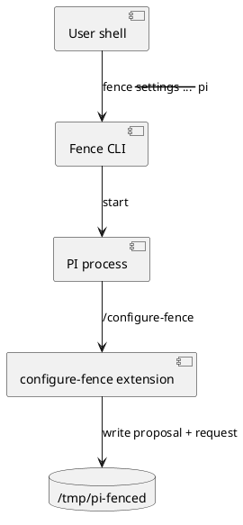
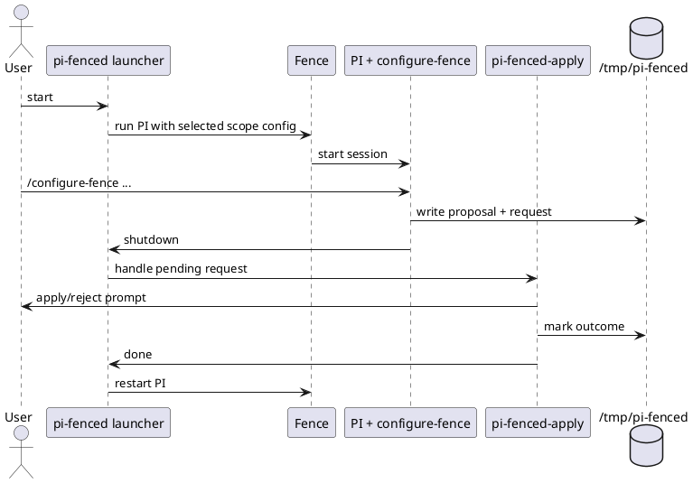

# Task: Fence-first PI runtime with external configuration apply
- **Task Identifier:** 2026-04-21-fence-workflow
- **Scope:**
  Build `pi-fenced` as a Fence-first runtime with three cooperating
  parts: launcher (`pi-fenced`), external applier
  (`pi-fenced-apply`), and in-PI `/configure-fence` proposal flow.
- **Motivation:**
  Keep one enforcement boundary (Fence) for all PI tool execution while
  preserving safe policy evolution through explicit, outside-of-PI
  approval and rollback.
- **Scenario:**
  A user runs PI through `pi-fenced`. During a session, the user asks
  `/configure-fence` for a policy change. PI creates a proposal and
  request in `/tmp/pi-fenced`, then exits. The external launcher asks
  the user to apply or reject. On apply, it updates the selected scope
  config atomically and restarts PI.
- **Constraints:**
  - Active config precedence is strict and non-merged:
    `session > workspace > global`.
  - Active scope config files must not use top-level `extends`.
  - Active scope config files are not writable from inside fenced PI.
  - Extension activation is guarded: full feature registration is
    allowed only when running inside Fence and launched by
    `pi-fenced.sh`.
  - If guard conditions are not met, extension must self-disable
    command/tool registration and publish status indicating no Fence
    runtime is active.
  - External apply flow owns apply/reject/rollback decisions.
  - Temporary control artifacts live under `/tmp/pi-fenced`.
- **Briefing:**
  Existing `../pi-fenced/design.md` defines the target architecture.
  Current scaffold files are:
  - `../pi-fenced/index.ts`
  - `../pi-fenced/configure-fence.ts`
  - `../pi-fenced/tests/configure-fence.test.ts`
  - `../pi-fenced/package.json`
  - `../pi-fenced/tsconfig.json`
- **Research:**
  Verified current state:
  - `pi-fenced` currently has design + extension scaffold only.
  - Launcher and external applier are not implemented yet.

- **Design:**
  Canonical architecture and contracts are tracked in
  `../pi-fenced/design.md`. This task executes that design in ordered
  subtasks.

- **Test specification:**
  - Subtask-specific test plans are defined per subtask below.
  - End-to-end coverage must include apply, reject, stale-hash, and
    rollback paths before review.

## Subtask: Implement `pi-fenced` launcher with strict scope selection
- **Status:** backlog
- **Scope:**
  Add launcher CLI that resolves active config by strict priority
  (`session > workspace > global`) and starts PI under Fence.
- **Motivation:**
  Ensure all PI execution is fenced while making scope choice
  deterministic and non-merged.
- **Scenario:**
  Launcher starts PI using exactly one scope config file and fails fast
  if the chosen file violates no-merge policy.
- **Constraints:**
  - Use only one `--settings` file per run.
  - Reject chosen scope config when top-level `extends` is present.
- **Briefing:**
  Follow `design.md` path rules and scope precedence definitions.
- **Research:**
  To be done.
- **Design:**
  To be done.
- **Test specification:**
  - **Automated tests:**
    - Config resolution precedence tests.
    - `extends` rejection tests for each scope.
    - Launch command construction tests.
  - **Manual tests:**
    - Run launcher with each scope present/absent combination.

## Subtask: Implement external apply command with approve/reject/rollback
- **Status:** backlog
- **Scope:**
  Build `pi-fenced-apply` that consumes queued requests, validates
  proposal/base hash, performs interactive apply/reject, and rolls back
  safely on failure.
- **Motivation:**
  Keep config mutation outside fenced PI and provide explicit user
  control with recovery guarantees.
- **Scenario:**
  User receives diff prompt, selects apply or reject, and launcher
  resumes with consistent configuration state.
- **Constraints:**
  - Atomic write on apply (`tmp + rename`).
  - Backup before mutation and rollback on failure.
  - Validate config before and after apply.
- **Briefing:**
  Request envelope format is defined in `design.md` and extension code.
- **Research:**
  To be done.
- **Design:**
  To be done.
- **Test specification:**
  - **Automated tests:**
    - Envelope validation tests.
    - Base hash mismatch tests.
    - Apply success and rollback-on-failure tests.
  - **Manual tests:**
    - Interactive apply/reject smoke tests.

## Subtask: Complete `/configure-fence` extension handoff behavior
- **Status:** in-progress
- **Scope:**
  Finalize extension behavior so runtime guard checks, proposal
  generation, user approval, request writing, and optional shutdown
  handoff are reliable and aligned with external applier contract.
- **Motivation:**
  Provide a guided in-PI UX similar to `/configure-sandbox` while
  respecting outside-of-PI mutation boundaries.
- **Scenario:**
  User submits natural-language change request and gets a validated,
  reviewable proposal queued for external apply.
- **Constraints:**
  - Extension must not mutate active scope config directly.
  - Proposal content must be valid JSON object without top-level
    `extends`.
  - Extension must verify it runs inside Fence and under
    `pi-fenced.sh`; otherwise it must not register functional behavior
    and must show status that no Fence runtime is active.
- **Briefing:**
  Initial scaffold exists in `index.ts` and `configure-fence.ts`.
- **Research:**
  Current scaffold already implements out-of-band structured calls,
  mutation preview, request/proposal file writes, and shutdown prompt.
  Remaining work is integration hardening against launcher/applier
  contracts and end-to-end verification.
- **Design:**
  Keep schema-first tool-call loop and exact-edit semantics from current
  scaffold; align request envelope fields and error messaging with
  `pi-fenced-apply`.
- **Test specification:**
  - **Automated tests:**
    - Extend request envelope construction tests.
    - Add invalid-content and no-extends guard tests.
    - Add runtime guard tests for both positive and negative startup
      conditions (inside Fence + launched by `pi-fenced.sh` vs not).
    - Add shutdown-path behavior tests where feasible.
  - **Manual tests:**
    - Start PI via `pi-fenced.sh` and verify enabled status line.
    - Start PI outside Fence launcher and verify extension is
      self-disabled with status indicating no Fence runtime.
    - Real `/configure-fence` run with queued request visible in
      `/tmp/pi-fenced/control`.

## Subtask: Wire launcher and applier into full restart loop
- **Status:** backlog
- **Scope:**
  Connect process lifecycle: PI exit -> request detection -> external
  apply/reject -> restart PI.
- **Motivation:**
  Make configuration changes operationally complete without manual
  orchestration steps.
- **Scenario:**
  After `/configure-fence`, user sees one continuous flow controlled by
  launcher until PI restarts with selected outcome.
- **Constraints:**
  - No automatic silent apply.
  - Missing/invalid request files must not crash launcher loop.
- **Briefing:**
  Integrate outputs from subtasks 1-3.
- **Research:**
  To be done.
- **Design:**
  To be done.
- **Test specification:**
  - **Automated tests:**
    - Loop control tests for no-request and request-present exits.
    - Error-path tests for malformed request file.
  - **Manual tests:**
    - End-to-end apply and reject runs with restart confirmation.

## Subtask: Document operations and failure recovery runbook
- **Status:** backlog
- **Scope:**
  Document install, launch, scope behavior, configure flow, and failure
  recovery (stale hash, validation failure, rollback).
- **Motivation:**
  Make system usage predictable for daily use and debugging.
- **Scenario:**
  Operator can recover quickly from apply failures and understand why a
  request was rejected.
- **Constraints:**
  - Documentation must match implemented behavior exactly.
- **Briefing:**
  Update project README and add dedicated runbook section/file.
- **Research:**
  To be done.
- **Design:**
  To be done.
- **Test specification:**
  - **Automated tests:** N/A
  - **Manual tests:**
    - Walk through documented procedures and verify outcomes.
